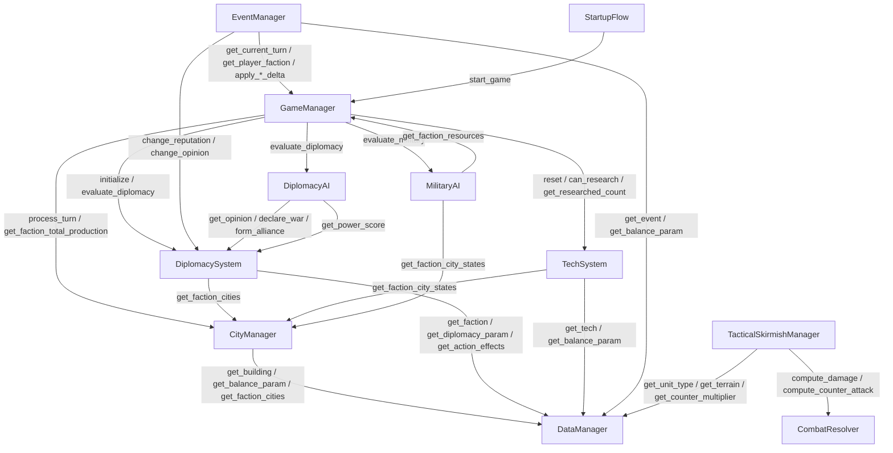

# CODEMAP — 项目代码导航索引

> 更新于 2026-06-18，供快速定位文件职责和关键函数。

---

## 1. Autoload 单例（scripts/autoload/）

### signal_bus.gd — 62行
全局信号总线，零逻辑。声明 40+ 信号供系统间解耦通信。
- 信号分类：回合(turn_started/ended)、事件(event_triggered/resolved)、外交(war_declared/alliance_formed)、科技(tech_research_completed)、城市(city_occupied/building_completed)、安定度(stability_changed/revolt_occurred)

### data_manager.gd — 491行
只读数据层。启动时加载 `data/*.json`，构建 id 索引，提供查询 API。
- `get_terrain(id)` / `get_unit_type(id)` / `get_city(id)` — 基础查询
- `get_balance_param(path)` — 点分路径查询平衡参数（如 `combat.fire_atk_bonus`）
- `get_counter_multiplier(atk_id, def_id)` — 克制矩阵
- `get_faction(faction_id)` / `get_ai_personality(faction_id)` — 国家与 AI 性格
- `get_tech(tech_id)` / `get_diplomacy_param(path)` — 科技与外交参数
- `get_faction_cities(faction_id)` — 按势力查城市列表
- `validate_data()` — 运行时数据完整性校验

### startup_flow.gd — 110行
启动流程管理器：Splash → 公告 → 模式选择 → 势力选择 → 加载 → 游戏场景切换。
- `start_full_flow()` — 从头开始完整启动流程
- `quick_start(faction_id, mode)` — 跳过前置流程，直接进入游戏
- `goto_splash()` / `goto_mode_select()` / `goto_faction_select()` / `goto_loading()` / `goto_game()` — 场景跳转
- `on_splash_finished()` / `on_mode_selected(mode_id)` / `on_faction_selected(faction_id)` / `on_loading_finished()` — 流程回调

### game_manager.gd — 538行
游戏主循环状态机。Phase: GAME_INIT → TURN_START → ACTION → TURN_END → GAME_OVER。
- `start_game(active_factions, player_faction)` — 初始化并开始游戏
- `end_current_turn()` — 结束当前势力回合，推进到下一个
- `process_ai_turn()` — AI 行动入口：外交→科技→军事→结束
- `check_victory()` — 征服胜利判定（最后存活 / 玩家灭亡）
- `get_faction_resources(faction_id)` / `apply_faction_resource_delta(...)` — 资源管理
- `add_units(faction_id, unit_id, count)` / `remove_units(...)` — 兵种构成管理
- `set_tax_rate(rate)` / `get_morale_threshold_effect()` — 税率与民心系统
- `reset()` — 重置到初始状态

### city_manager.gd — 1140行
50 城运行时状态管理。建造/升级/拆除、占领、征兵、驻军、安定度、产出计算。
- `get_city_state(city_id)` / `get_faction_city_states(faction_id)` — 城市查询
- `can_build(city_id, building_id)` / `start_build(...)` — 建造校验+执行
- `can_upgrade(city_id, building_id)` / `start_upgrade(...)` — 升级校验+执行
- `demolish(city_id, building_id)` — 拆除建筑（按难度返还资源）
- `occupy_city(city_id, new_faction_id)` — 占领城池（HP 恢复+清空队列）
- `conscribe(city_id, amount)` — 从征兵池征兵
- `assign_garrison(city_id, amount)` / `withdraw_garrison(city_id, amount)` — 驻军管理
- `get_city_production(city_id)` / `get_faction_total_production(faction_id)` — 产出计算
- `process_turn(faction_id)` — 回合结算：建造队列+人口增长+安定度

### event_manager.gd — 366行
三阶段事件管线：链式事件(保证触发) → 季节事件(概率 1.0) → 池竞争(优先级排序)。
- `resolve_event_choice(event_id, choice_id)` — 处理玩家事件选择
- `can_afford_option(event_id, choice_id)` — 检查选项资源是否足够
- `get_active_chains()` — 获取当前激活的事件链状态
- `get_save_data()` / `load_save_data(data)` — 序列化/反序列化
- `reset()` / `set_muted(muted)` — 重置/静默

### diplomacy_system.gd — 547行
外交系统：好感/声望/条约/战争/附庸/商路/通行权，13 种外交行动。
- `initialize(active_factions)` — 初始化外交状态
- `declare_war(attacker, defender)` — 宣战（断盟+降好感+声望惩罚）
- `form_alliance(faction_a, faction_b)` — 结盟（好感≥30）
- `propose_ceasefire(proposer, target, terms)` / `accept_ceasefire(...)` — 停战
- `send_gift(sender, receiver, tier)` — 送礼提升好感
- `request_vassal_escape(vassal_id, method)` — 附庸独立（3 种方式）
- `get_opinion(faction_a, faction_b)` / `get_reputation(faction_id)` / `get_power_score(faction_id)` — 查询
- `reset()` — 重置

### tech_system.gd — 446行
科技研究系统。文件位于 `scripts/systems/tech_system.gd`，并注册为 Autoload。当前科技数已扩展到 72 项，支持前置条件/特殊条件/效果叠加与 AI 研究独立追踪。
- `start_research(tech_id)` / `can_research(tech_id)` — 研究控制
- `get_attack_modifier(target)` / `get_defense_modifier(target)` — 战斗修正查询
- `is_unit_unlocked(unit_id)` / `can_traverse_terrain(terrain)` — 解锁查询
- `get_morale_bonus()` / `get_movement_bonus()` / `get_culture_bonus()` — 加成查询
- `start_ai_research(faction_id, tech_id)` / `get_ai_researched_techs(faction_id)` — AI 科技
- `reset()` — 重置

### tactical_skirmish_manager.gd — 1343行
**最大文件**。战术演武引擎：六角格 Dijkstra 寻路、战斗结算、攻城、海军、火攻、补给、士气、AI。
- `start_skirmish()` / `start_skirmish_with_config(cfg, season)` — 开始演武
- `try_move_unit(unit_id, dest)` — 移动单位
- `try_player_attack(attacker_id, defender_id)` — 执行攻击（含反击/夹击/火攻/海军修正）
- `compute_attack_preview(attacker_id, defender_id_or_cell)` — 伤害预览（不扣血）
- `try_attack_city_wall(attacker_id, cell)` — 直接攻击城墙
- `try_retreat(unit_id)` — 撤退（消耗全部移动力+追击）
- `end_player_turn()` — 结束玩家回合（执行 AI+开启下一阶段）
- `begin_player_phase()` — 回合开始处理（士气/灼烧 DOT/补给/治疗/溃退）
- `check_victory()` — 占领敌方城格即胜（需城墙摧毁+无关隘阻断）

---

## 2. Autoload 调用依赖图

| 调用方 | 被调用方 | 关键接口 |
|---|---|---|
| GameManager | CityManager | `process_turn()`, `get_faction_total_production()`, `get_city_state()` |
| GameManager | DiplomacySystem | `initialize()`, `evaluate_diplomacy()` |
| GameManager | DiplomacyAI | `evaluate_diplomacy()` |
| GameManager | MilitaryAI | `evaluate_military()` |
| GameManager | TechSystem | `reset()`, `get_ai_researched_techs()`, `start_ai_research()`, `get_faction_action_speed_bonus()` |
| CityManager | DataManager | `get_building()`, `get_balance_param()`, `get_faction_cities()` |
| DiplomacySystem | DataManager | `get_faction()`, `get_diplomacy_param()`, `get_action_effects()` |
| DiplomacySystem | CityManager | `get_faction_cities()` |
| EventManager | GameManager | `get_current_turn()`, `get_player_faction()`, `apply_*_delta()` |
| EventManager | DiplomacySystem | `change_reputation()`, `change_opinion_all_toward()` |
| TechSystem | DataManager | `get_tech()`, `get_balance_param()` |
| TechSystem | CityManager | `get_faction_city_states()` |
| TacticalSkirmishManager | DataManager | `get_unit_type()`, `get_terrain()`, `get_counter_multiplier()` |
| TacticalSkirmishManager | CombatResolver | `compute_damage()`, `compute_counter_attack()` |
| DiplomacyAI | DiplomacySystem | `get_opinion()`, `declare_war()`, `form_alliance()`, `get_power_score()` |
| MilitaryAI | CityManager | `get_faction_city_states()` |
| MilitaryAI | GameManager | `get_faction_resources()` |

---

## 3. 系统模块（scripts/systems/）

### combat_resolver.gd — 239行
纯函数战斗伤害计算器，无状态。公式：攻防加法层 → 克制乘算 → 扣减防御 → 随机波动(±10%) → 崩溃态乘算。
- `compute_damage(...)` — 完整伤害流水线，返回 `{damage, was_ambush, skipped, effective_atk}`
- `compute_counter_attack(...)` — 反击伤害（委托给 compute_damage）
- `compute_counter_multiplier(atk_id, def_id)` — 克制乘算（含 anti_cavalry 覆盖）
- `is_ranged_unit(unit_type_id)` — 远程单位判断
- `should_trigger_counter(def_type, is_ranged_atk)` — 近战触发反击，远程不触发
- `compute_siege_damage(...)` — 攻城伤害计算
- `compute_city_counter_damage(...)` — 城池反击伤害

### hex_axial.gd — 74行
静态六角坐标工具类（class_name HexAxial）。
- `offset_odd_r_to_axial(col, row)` / `axial_to_offset_odd_r(q, r)` — 坐标转换
- `hex_distance_hex(a, b)` / `hex_distance_axial(...)` — 六角距离
- `neighbors_hex(cell)` — 6 个邻居坐标
- `axial_flat_top_cell_top_left(...)` — 平顶六角像素定位

### skirmish_ai.gd — 231行
AI 战术回合执行器。持有 manager 引用，通过它访问所有战斗/移动/状态私有 API。
- `initialize(manager)` — 初始化 manager 引用
- `run_turn()` — 执行 AI 回合：烧伤 DOT→断粮→士气恢复→移动→攻击→溃退→治疗

### skirmish_attack_pipeline.gd — 555行
战术演武攻击流水线。从 TacticalSkirmishManager 提取的三个超长函数。
- `initialize(manager)` — 初始化 manager 引用
- `execute_player_attack(attacker_id, defender_id)` — 玩家攻击执行（含反击/夹击/火攻/海军/城防分流）
- `execute_city_wall_attack(attacker_id, cell)` — 直接攻击城墙
- `compute_preview(attacker_id, defender_id_or_cell)` — 攻击预览（含加成明细和反击预览）

### unit_movement_manager.gd — 108行
单位移动管理器（class_name UnitMovementManager）。
- `request_move(unit, target_hex)` — 请求移动（空闲直接执行，忙则入队列）
- `get_reachable_hexes(unit, move_range)` — BFS 泛洪返回可达范围
- `find_path(start_hex, end_hex)` — 简化寻路（贪心最近邻）
- `set_map_bounds(q_min, q_max, r_min, r_max)` — 设置地图边界

---

## 4. AI 模块（scripts/ai/）

### diplomacy_ai.gd — 252行
静态类 DiplomacyAI。AI 外交决策引擎。概率触发，性格加权。
- `evaluate_diplomacy(faction_id, turn_number)` — 入口：概率触发外交评估（宣战/停战/结盟/合纵）
- `evaluate_ceasefire_offer(faction_id, terms)` — 评估停战报价，返回是否接受
- `generate_counter_offer(faction_id, original_terms)` — AI 生成还价

### military_ai.gd — 342行
静态类 MilitaryAI。AI 军事决策系统。数据驱动，由 GameManager.process_ai_turn() 调用。
- `evaluate_military(faction_id)` — 入口：征兵→攻城→驻军

---

## 5. UI 脚本（scripts/ui/）

### shader_helpers.gd — 86行
静态类 ShaderHelpers。ShaderMaterial 工厂方法（文化覆盖/羊皮纸 UI/按钮状态/高亮脉冲）。

### skirmish_hex_cell.gd — 173行
单个六角格控件（class_name SkirmishHexCell）。平顶六角形绘制/地形纹理映射/色调叠加/点击检测。
- `configure(q, r, radius, box_w, box_h)` — 配置六角格参数
- `set_terrain_texture(tex)` / `set_tint_color(c)` — 设置纹理和色调
- `notify_size_changed()` — 尺寸变更通知

### skirmish_hex_map_canvas.gd — 67行
六角地图画布渲染器。单次 `_draw()` 绘制所有地形，消除接缝。

### skirmish_tile_textures.gd — 250行
静态类 SkirmishTileTextures。地形/阵营/事件/兵种贴图路径注册表，缓存加载。

---

## 6. 单位脚本（scripts/units/）

### unit.gd — 201行
单位实体控制器（class_name Unit）。管理类型/阵营/六角格位置/动画状态机(IDLE/MOVE/ATTACK/HURT/DEATH)。
- `setup(unit_type, faction, hex_position)` — 初始化单位参数
- `move_to(target_hex)` — 开始移动到目标格
- `play_attack()` / `play_hurt()` / `play_death()` — 播放动画

---

## 7. 场景脚本（scenes/）

### main.gd — 316行
主场景根节点。连接 UI 按钮到游戏系统，初始化 7 势力。
- `open()` / `close()` 面板管理；`_on_next_turn_pressed()` 结束回合

### big_map_panel.gd — 475行
大地图面板。30×20 六角格地图显示 50 城+势力着色；缩放/政治模式切换。
- `open()` / `close()` — 打开/关闭面板
- `_on_hex_pressed(q, r)` — 城池点击信号

### city_panel.gd — 467行
城池管理面板。城池信息/建筑列表/建造队列/可建造项+图标映射。
- `open(city_id)` / `close()` — 打开/关闭面板

### diplomacy_panel.gd — 249行
外交面板。势力列表+声望好感显示/操作按钮。
- `open()` — 打开外交面板

### negotiation_dialog.gd — 175行
停战谈判对话框。赔款输入/城池选择/附庸复选框；3 轮谈判历史。
- `open(proposer, target)` — 打开谈判对话框

### event_popup.gd — 172行
事件弹窗。显示事件插图/描述/玩家选项；监听 `SignalBus.event_triggered`。

### event_test_panel.gd — 130行
事件测试面板。手动触发事件用于调试。
- `open()` — 打开面板

### resource_bar.gd — 72行
顶部资源栏。显示 10 种玩家资源（粮/金/木/马/精铁/匠人/建材/兵/人口/士气）；回合开始自动刷新。
- `refresh()` — 手动刷新资源显示

### skirmish_mvp_panel.gd — 782行
战术演武主 UI。六角格面板渲染/单位选择移动攻击/悬停信息/战斗特效/回合管理。
- `open_panel()` / `close_panel()` — 打开/关闭

### skirmish_scenario_panel.gd — 130行
演武场景选择器。从 `skirmish_scenarios.json` 列出场景/季节选择/开始按钮。
- `open_panel()` / `close_panel()` — 打开/关闭

### skirmish_test_guide_panel.gd — 262行
演武测试指南面板。显示各场景的测试步骤和预期行为。
- `open_guide(scenario_id)` — 打开指定场景的测试指南

### announcement_popup.gd — 62行
卷轴式公告弹窗。开合动画+落印。
- `show_announcement(title, body)` — 显示公告

### faction_select.gd — 96行
势力选择。7 战国势力，含立绘/描述/特色兵种/加成。

### loading_screen.gd — 118行
加载画面。旋转六角框/武器图标轮播/打字机提示文字。
- `start_loading(target_scene)` / `finish_loading()` — 加载控制

### mode_select.gd — 146行
游戏模式选择。4 模式（经典/快速/剧情/沙盒）卡片式 UI。

### splash_screen.gd — 65行
动画启动画面。Logo 淡入淡出，点击跳过。

### tech_tree_panel.gd — 372行
科技树面板。54 项科技，3 列（早/中/晚期）×4 行（军事/经济/文化/建筑）；点击研究。

### buff_panel.gd — 115行
Buff/Debuff 信息面板。显示激活效果+图标/持续时间/来源/描述。
- `show_buffs(buffs)` — 显示增减益列表

---

## 8. 数据文件（data/）

| 文件 | 大小 | 内容 | 主要消费者 |
|------|------|------|------------|
| balance_params.json | 30KB | 战斗/资源/士气/移动/AI 全局平衡参数 | GameManager, CityManager, CombatResolver, TacticalSkirmishManager, TechSystem, EventManager |
| big_map_terrain.json | 115KB | 30×20 大地图地形网格 | BigMapPanel, CityManager |
| buildings.json | 26KB | 建筑定义（经济/军事，最多 3 级） | CityManager |
| cities.json | 15KB | 50 城坐标/人口/阵营/发展度 | CityManager, DataManager |
| diplomacy.json | 8KB | 外交参数：礼物/行动效果/AI 决策阈值 | DiplomacySystem |
| events.json | 99KB | 88 个随机事件（8 类别）+ 2 条事件链 | EventManager |
| factions.json | 4KB | 七国定义：AI 性格/颜色/学派/加成 | GameManager, DiplomacyAI |
| ministers.json | 16KB | 大夫模板（文武外交三类） | DataManager (加载，运行时管理器未实现) |
| schools.json | 22KB | 六大学派定义与效果 | DataManager（已加载，完整系统待实现） |
| skirmish_scenarios.json | 14KB | 7 个演武场景定义 | TacticalSkirmishManager |
| tactical_skirmish_mvp.json | 1KB | MVP 演武地图 | TacticalSkirmishManager |
| tech_events.json | 8KB | 科技触发事件 | DataManager (加载，对接待实现) |
| tech_synergies.json | 6KB | 科技协同组合 | DataManager (加载，对接待实现) |
| tech_tree.json | 85KB | 72 项科技树 | TechSystem |
| terrain.json | 7KB | 11 种地形 | DataManager, CombatResolver |
| units.json | 14KB | 19 种兵种（含国家变体） | DataManager, CombatResolver |
| wonders.json | 8KB | 奇观建筑 | DataManager, CityManager |

---

## 9. 设计文档（docs/）

| 目录 | 文件数 | 内容 |
|------|--------|------|
| docs/ | 9 | 根入口与保留文档（README、CODEMAP、执行计划、接口文档等） |
| docs/机制概览/ | 15 | 完整游戏机制设计（战斗/城市/外交/大夫/季节/学派/情报/文化/民心/科技/粮食/经营/事件/地理） |
| docs/策划决策/ | 23 | 各阶段决策记录（阶段 0~6 + 重制决策） |
| docs/美术进度/ | 4 | 美术交付清单与程序交付说明 |
| docs/程序进度/ | 3 | 已实现功能清单、审计差异、分支差异 |
| docs/协作/ | 7 | 当前使用中的中文协作入口、模板与清单 |
| docs/测试指南/ | 1 | 演武场景测试指南 |
| docs/归档/ | 10 | 过程稿、英文协作参考、历史重复副本 |
