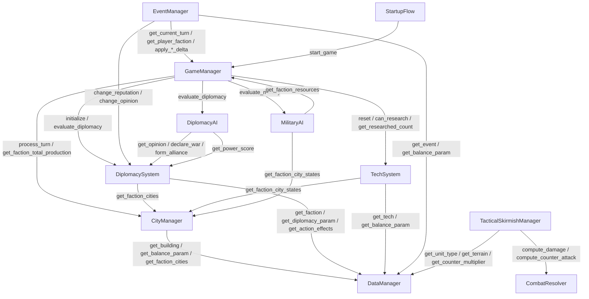

# 任务：《山河策》CODEMAP 更新 + AGENTS.md 文件索引同步

> 你是本项目的文档维护 Agent。根据仓库中**实际代码和数据文件**，更新两份核心导航文档。
> **只修改这两个文件**：`docs/CODEMAP.md` 和 `AGENTS.md`。不改任何代码或数据文件。

---

## 文件一：docs/CODEMAP.md

### 要求

全面重写 `docs/CODEMAP.md`，以当前仓库实际状态为准。结构保持现有分段（Autoload → 系统模块 → AI → UI → 单位 → 场景 → 数据），但内容全部刷新。

### 每个 .gd 文件条目格式

```markdown
### 文件名 — N行
一句话职责说明。
- `func_name(params)` — 功能说明
- `func_name(params)` — 功能说明
（只列公共方法，不列私有方法）
```

### 当前实际行数（必须精确使用这些数字）

**Autoload 单例（scripts/autoload/）**：
- `signal_bus.gd` — 84行
- `data_manager.gd` — 515行
- `game_manager.gd` — 692行
- `city_manager.gd` — 1337行
- `event_manager.gd` — 447行
- `diplomacy_system.gd` — 744行
- `tech_system.gd` — 464行（注意：此文件在 scripts/systems/ 目录，但作为 Autoload 注册）
- `tactical_skirmish_manager.gd` — 1553行
- `startup_flow.gd` — 135行

**系统模块（scripts/systems/）**：
- `combat_resolver.gd` — 290行
- `hex_axial.gd` — 96行
- `skirmish_ai.gd` — 247行
- `skirmish_attack_pipeline.gd` — 579行
- `unit_movement_manager.gd` — 147行

**AI（scripts/ai/）**：
- `diplomacy_ai.gd` — 338行
- `military_ai.gd` — 384行

**UI 辅助（scripts/ui/）**：
- `shader_helpers.gd` — 86行
- `skirmish_hex_cell.gd` — 224行
- `skirmish_hex_map_canvas.gd` — 77行
- `skirmish_tile_textures.gd` — 266行

**单位（scripts/units/）**：
- `unit.gd` — 201行
- `unit_movement_test.gd` — 156行

**场景脚本（scenes/）**：
- `main.gd` — 195行
- `big_map_panel.gd` — 554行
- `city_panel.gd` — 565行
- `diplomacy_panel.gd` — 310行
- `negotiation_dialog.gd` — 215行
- `event_popup.gd` — 207行
- `event_test_panel.gd` — 163行
- `resource_bar.gd` — 88行
- `skirmish_mvp_panel.gd` — 860行
- `skirmish_scenario_panel.gd` — 136行
- `skirmish_test_guide_panel.gd` — 298行
- `announcement_popup.gd` — 80行
- `faction_select.gd` — 100行
- `loading_screen.gd` — 132行
- `mode_select.gd` — 149行
- `splash_screen.gd` — 68行
- `tech_tree_panel.gd` — 373行
- `buff_panel.gd` — 123行

### Autoload 调用依赖图（新增章节）

在 Autoload 章节之后、系统模块章节之前，新增一个 `## Autoload 调用依赖图` 章节，包含 Mermaid 图和文字说明。

**Mermaid 图**：


**文字说明表格**：

| 调用方 | 被调用方 | 关键接口 |
|---|---|---|
| GameManager | CityManager | `process_turn()`, `get_faction_total_production()`, `get_city_state()` |
| GameManager | DiplomacySystem | `initialize()`, `evaluate_diplomacy()` |
| GameManager | DiplomacyAI | `evaluate_diplomacy()` |
| GameManager | MilitaryAI | `evaluate_military()` |
| GameManager | TechSystem | `reset()`, `get_researched_count()` |
| CityManager | DataManager | `get_building()`, `get_balance_param()`, `get_faction_cities()` |
| DiplomacySystem | DataManager | `get_faction()`, `get_diplomacy_param()`, `get_action_effects()` |
| DiplomacySystem | CityManager | `get_faction_cities()` |
| EventManager | GameManager | `get_current_turn()`, `get_player_faction()`, `apply_*_delta()` |
| EventManager | DiplomacySystem | `change_reputation()`, `change_opinion_all_toward()` |
| TechSystem | DataManager | `get_tech()`, `get_balance_param()` |
| TechSystem | CityManager | `get_faction_city_states()` |
| TacticalSkirmishManager | DataManager | `get_unit_type()`, `get_terrain()`, `get_counter_multiplier()` |
| TacticalSkirmishManager | CombatResolver | `compute_damage()`, `compute_counter_attack()` |
| DiplomacyAI | DiplomacySystem | `get_opinion()`, `declare_war()`, `form_alliance()`, `get_power_score()` |
| MilitaryAI | CityManager | `get_faction_city_states()` |
| MilitaryAI | GameManager | `get_faction_resources()` |

### 数据文件表格

更新 `## 7. 数据文件` 章节，每行标注文件大小和主要消费者（哪些 Autoload 读取它）。

**当前数据文件**：
| 文件 | 大小 | 消费者 |
|---|---|---|
| balance_params.json | 30KB | GameManager, CityManager, CombatResolver, TacticalSkirmishManager, TechSystem, EventManager |
| big_map_terrain.json | 115KB | BigMapPanel (scenes/ui/big_map/) |
| buildings.json | 26KB | CityManager |
| cities.json | 15KB | CityManager, DataManager |
| diplomacy.json | 8KB | DiplomacySystem |
| events.json | 99KB | EventManager |
| factions.json | 4KB | GameManager, DiplomacyAI |
| ministers.json | 16KB | DataManager (加载，运行时管理器未实现) |
| schools.json | 22KB | DataManager, CombatResolver (战斗加成查询) |
| skirmish_scenarios.json | 14KB | TacticalSkirmishManager |
| tactical_skirmish_mvp.json | 1KB | TacticalSkirmishManager |
| tech_events.json | 8KB | DataManager (加载，对接待实现) |
| tech_synergies.json | 6KB | DataManager (加载，对接待实现) |
| tech_tree.json | 85KB | TechSystem |
| terrain.json | 7KB | DataManager, CombatResolver |
| units.json | 14KB | DataManager, CombatResolver |
| wonders.json | 8KB | DataManager, CityManager |

---

## 文件二：AGENTS.md

### 要求

仅更新 AGENTS.md 中 `## 项目文件索引` 部分的以下表格：

1. **Autoload 单例表格**：更新行数，补充 `startup_flow.gd`，确保所有 9 个 Autoload 都在表中
2. **游戏系统表格**：补充 `military_ai.gd` 条目
3. **测试文件表格**：检查 `tests/unit/` 下实际有哪些文件，与表格对照，补齐缺失的测试文件

**不要修改** AGENTS.md 的其他任何章节（项目特定要求、快速定位指南、数据文件索引等）。

### Autoload 表格更新为：

| 文件 | 行数 | 职责 |
|---|---|---|
| `signal_bus.gd` | 84 | 全局信号总线，解耦系统间通信 |
| `data_manager.gd` | 515 | 启动时加载所有 `data/*.json`，提供只读索引访问 |
| `startup_flow.gd` | 135 | 启动流程管理：Splash → 公告 → 模式选择 → 势力选择 → 加载 → 游戏场景切换 |
| `game_manager.gd` | 692 | 主游戏循环控制器；状态机（GAME_INIT→TURN_START→ACTION→TURN_END→GAME_OVER） |
| `city_manager.gd` | 1337 | 50城运行时状态管理；建筑建造/升级/拆除、人口增长、安定度、征兵、产出计算 |
| `diplomacy_system.gd` | 744 | 外交系统：好感度/声望/条约/战争/附庸/商路/军事通行 |
| `event_manager.gd` | 447 | 三阶段事件管线：链式事件、季节事件、池竞争；管理冷却和条件触发 |
| `tech_system.gd` | 464 | 科技研究系统：54项科技的前置条件/研究成本/效果修正 |
| `tactical_skirmish_manager.gd` | 1553 | 战术演武管理器：六角格移动/战斗/攻城/关隘/火攻/断粮/撤退/ZoC |

### 游戏系统表格需补充：

| 文件 | 职责 |
|---|---|
| `military_ai.gd` | AI 军事决策系统：征兵/攻城/驻军策略 |

### 测试文件表格

读取 `tests/unit/` 目录下所有 `.gd` 文件名，与 AGENTS.md 中现有表格对比，补齐缺失的条目。

---

## 工作原则

1. **只改两个文件**：`docs/CODEMAP.md` 和 `AGENTS.md`。
2. **行数使用本 prompt 提供的精确数字**，不要自己重新统计。
3. **公共方法列表**：对于 CODEMAP 中每个 .gd 文件，读取文件获取 `func ` 开头的公共方法（无下划线前缀），只列最重要的 3-8 个，不要全部罗列。
4. **Mermaid 图**：直接使用本 prompt 提供的 Mermaid 代码块，不要修改节点 ID。
5. **中文输出**。
6. **不改代码**。
7. **完成后**：在 commentary 中报告两个文件的变更摘要。
